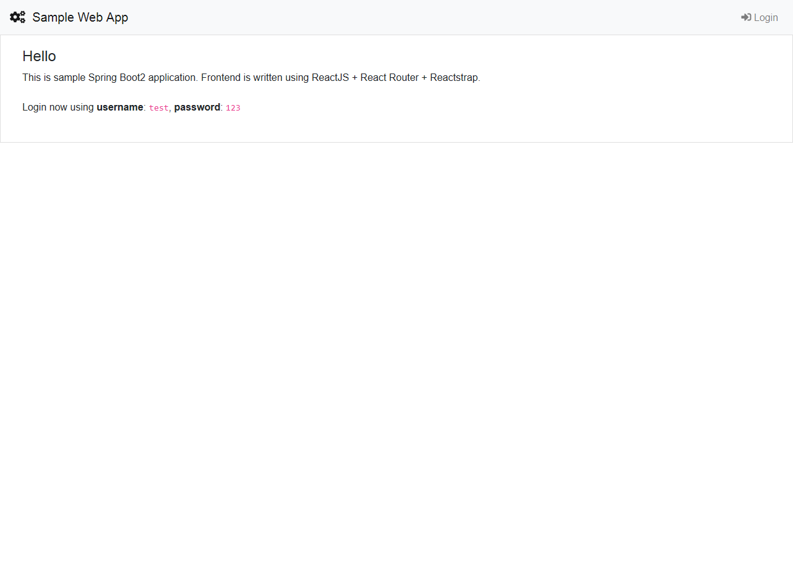
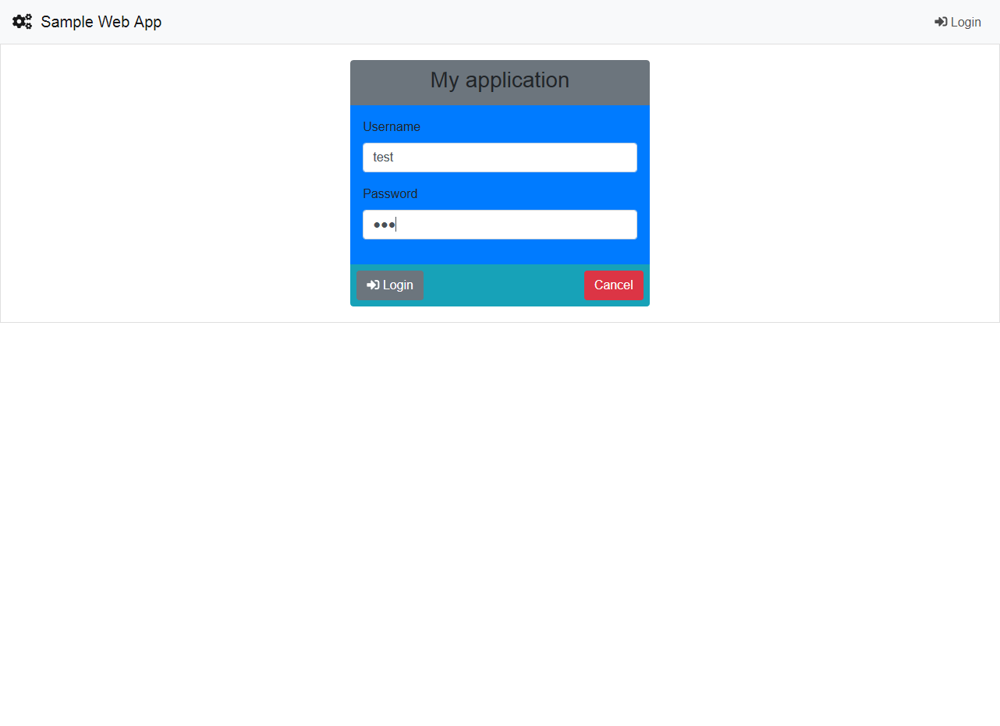
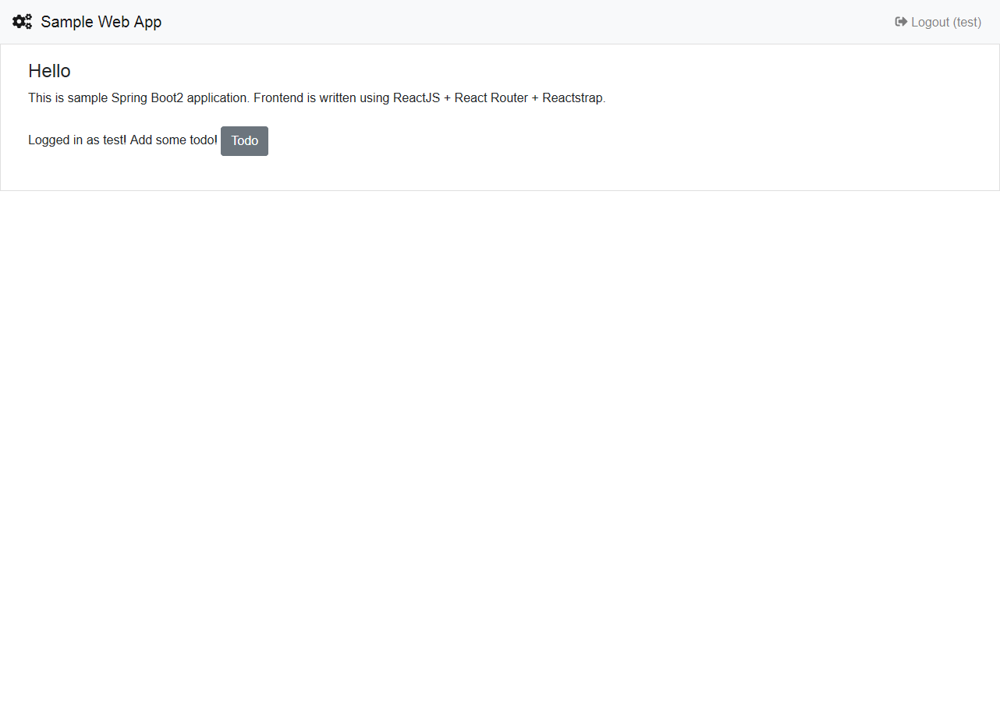
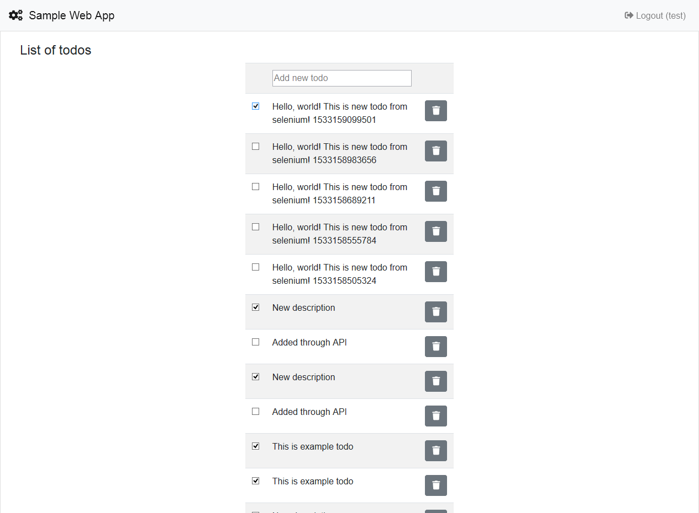
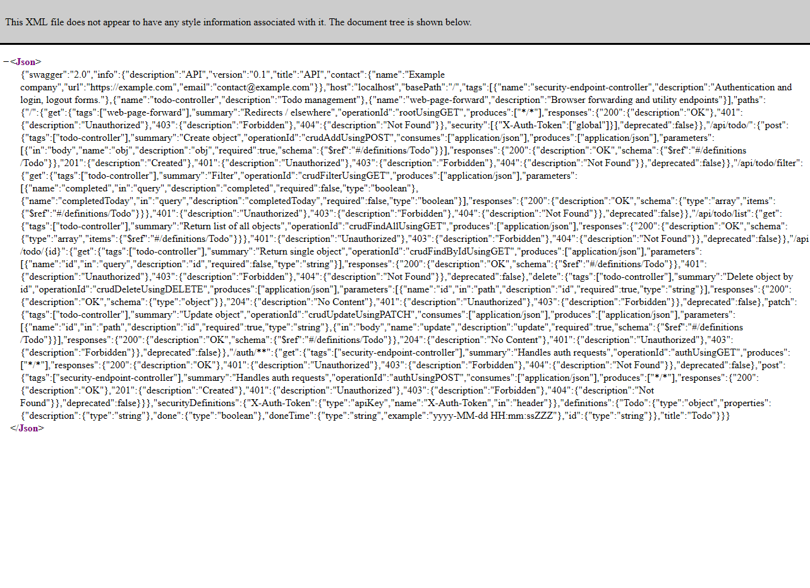
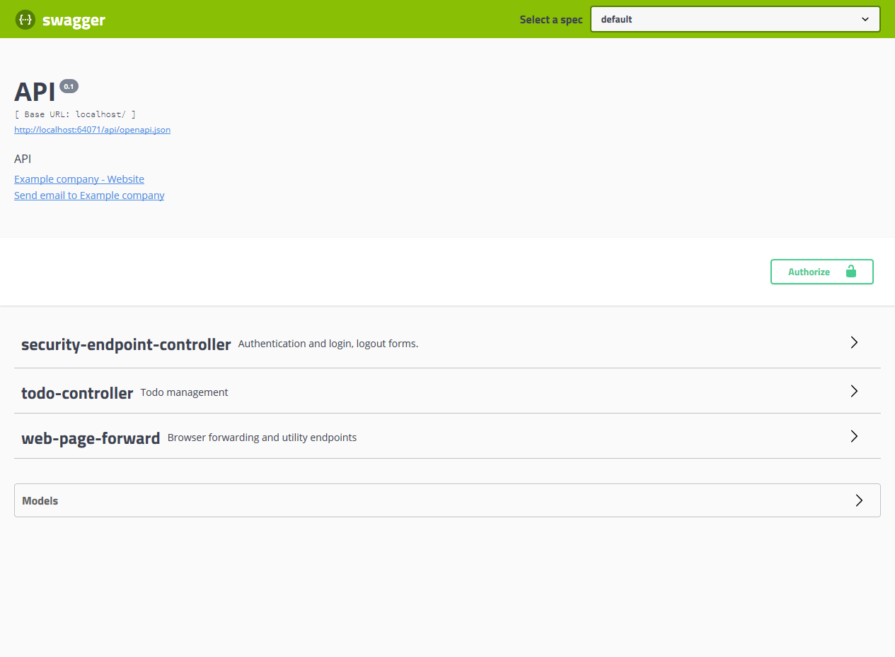
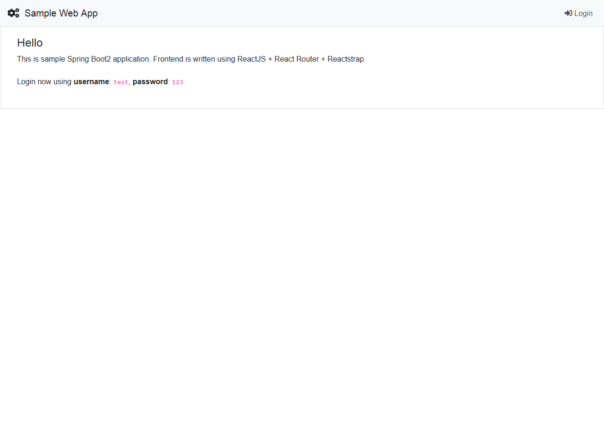

# Spring Boot 2 sample application

Opinionated Spring Boot 2 template.
Contains following features:

  * Java 8 Oracle JDK (base image openjdk:8-alpine)
  * Spring Boot 2 
  * Web classic API (no webflux, sorry)
  * Actuator enabled (/management/info and /management/health endpoints ONLY)
  * Redis configured (but disabled as cache by default)
  * Postgres configured (enabled by default)
  * Swagger2 API docs enabled (Swagger UI)
  * Spring Security enabled (Simple login as test:123)
  * Web interface is done as ReactJS app (create-react-app)
  * Sample welcome, login and logout forms
  * Sample Todo CRUD
  * Docker build (mvn package creates docker image) 
  * Docker compose setup with everything (launches redis, postgres, app)
  * JWT based external call/command line compatible auth
  * Asciidoc & javadoc generation (CircleCI build)
  
## Endpoints

  * Application (protected) - http://localhost:8087/
  * Swagger UI - http://localhost:8087/swagger-ui.html
  * API OpenSchema - http://localhost:8087/api/openapi.json
  * Information endpoint (protected) - http://localhost:8087/management/info
  * Health endpoint (unprotected) - http://localhost:8087/management/health
  * UI (react app, dev run) - http://localhost:3000/
  * Documentation - https://huksley.github.io/spring-boot2-template/
  * Javadoc - https://huksley.github.io/spring-boot2-template/javadoc/
 
## Building & Development

Follow these steps for development environment setup:

1. Run with h2 db for quick demo (you only need this to try it out)

```bash
mvn spring-boot:run -Dspring-boot.run.profiles=test -DskipTests
```

2. Start Postgres in docker before launching this project.

```bash
docker run --name postgre -e POSTGRES_PASSWORD=123 -e POSTGRES_USER=user -e POSTGRES_DB=test -p 5432:5432 -d postgres
```

3. Start Redis in docker (optional)

```bash
docker run --name redis -p 6379:6379 -d redis redis-server --appendonly yes
```

4. Go to src/main/resources/frontend folder and execute watch build UI:

```bash
yarn install
yarn run build
```

5. Run app in Intellij Idea IDE

6. (optional) Better way to develop is to run app and ui along side. All API endpoints are proxied front frontend webpack dev server to backend.

```bash
cd src/main/resources/frontend
yarn run start
```

open http://localhost:3000 and it will be automatically reloaded during modification.

## Additional maven flags

  * -Ddocker.skip=true - skip docker image creation
  * -Dassembly.skipAssembly=true - don't assemble fat JAR 
  * -Dmaven.gitcommitid.skip=true - skip git information gathering for /management/info endpoint
  * -DskipTests - skip running tests during build
  * -Dskip.npm -Dskip.yarn - Skip frontend build
  * -Dmaven.git.native=false - Don't use native git (use it if maven-git-commit hangs)
  * -Ddocker.image.from=openjdk:8 - override base Docker image
  * -Ddocker.image.prefix= - prefix created docker image name with this
  * -Ddocker.image.suffix= - suffix created docker image name with this 

## Production deployment

Everything is ready to run as container in Docker Compose setup.
Execute:

```bash
mvn package
docker-compose up -d
```

### Choosing the right Docker java base image

You might experience problems when using alpine based Java images, notable issues are using ulibc, missing fonts and graphics support. Problems might include not working PDF rendering, image operation, etc.

## Configurable variables

Look for a list of configurable variables in docker-compose.yml

## Log streaming

Project includes configuration to send logs to GELF compatible receivers - Fluentd (EFK), Logtstach (ELK), Graylog, etc...
To activate it, provide -Dlogging.config=classpath:logback-spring-gelf.xml in JAVA_OPTS when starting application.

To distinguish logs from this particular application provide -Dgelf.container=app-name in JAVA_OPTS. This will result in custom field container_name in GELF messages.

## Automatic UI testing

For automatic UI testing we are using Selenium Java and Geckodriver (Firefox).
For more info about geckodriver see here: https://github.com/mozilla/geckodriver

To run example TestSelenium.java class, provide following environment variables:

  * BROWSER = firefox
  * BROWSER_BINARY = full path to browser binary (Firefox 52+)
  * BROWSER_DRIVER = full path to geckodriver (download recent from https://github.com/mozilla/geckodriver)

## Screenshots

All screenshots provided here is taken automatically, using Selenium + Geckodriver. 
See section below __Automatic UI testing__.  
                                   







 
s